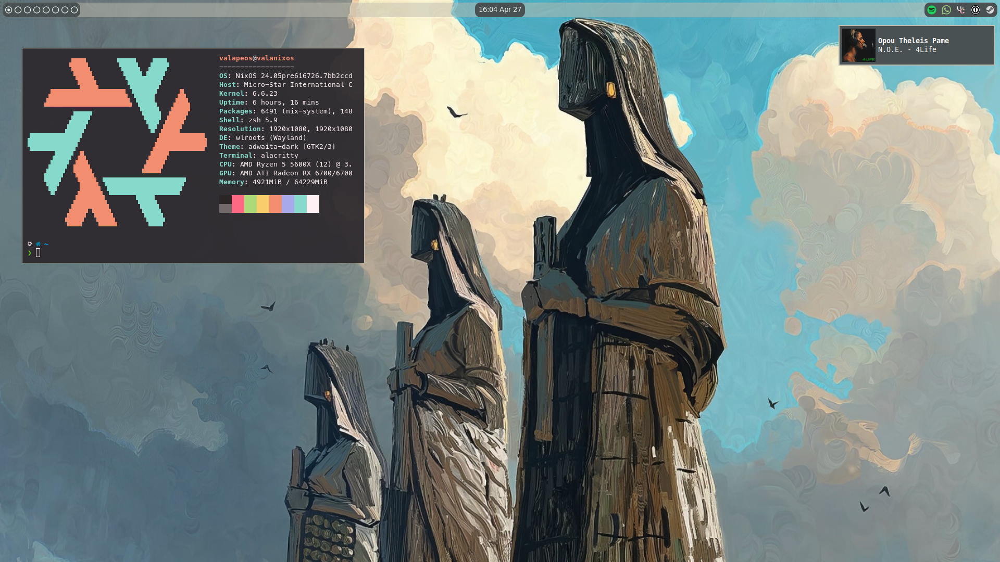

# dotfiles

I use NixOS so in the nixos file you will find the 'modular' (I wish) config I daily drive, and in the .config you will find whatever isn't declarable in NixOS 23.11.

Included are also the wallpapers I use. I ~~stole~~ found them online on different websites

## Components

- OS: NixOS
- Wayland Compositor: Labwc
- Launcher: bemenu
- Bar: Waybar
- Notifications: Mako
- Terminal Emulator: Alacritty
- Display Configuration: Kanshi
- Text Editor: Helix
- Shell: Zsh with Powerlevel10k prompt
